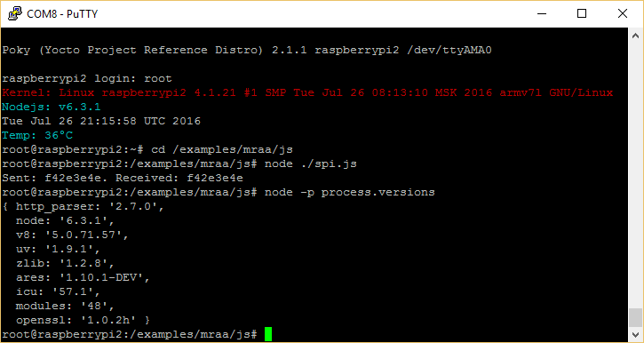
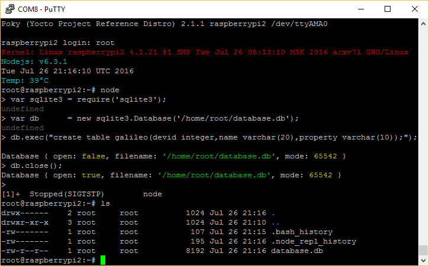
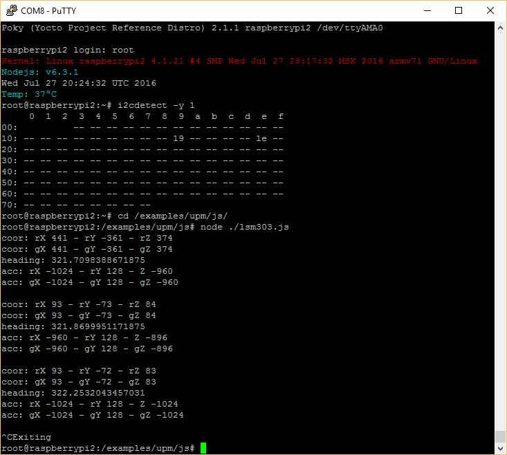

Brief
====
This SD card Linux image for Raspbery Pi 2 board is based on:
* Base: [Yocto meta-raspberrypi](http://git.yoctoproject.org/cgit/cgit.cgi/meta-raspberrypi/)
* Kernel: 4.1.21
* Many packets shown below

Link to download
====
[Download last version](https://relvarsoft.com/raspberry/raspberry_xbolshe_krogoth_kernel_v4.1.21_featured_201607271.zip)

Login: root (no password)

Installation
====
Use [Win32 Disk Imager for Windows](https://sourceforge.net/projects/win32diskimager/) or [dd for Linux]("https://en.wikipedia.org/wiki/Dd_(Unix)") to copy Linux image on SD card.

Software packets
====
* nodeJS 6.3.1
* node-SQLite 3.1.4
* mraa 1.1.2
* upm 0.7.2
* SQLite 3.13.0
* lshw B.02.17
* i2c-tools 3.1.1
* mc 4.8.14
* yasm 1.3.0
* curl 7.47.1
* usb-modeswitch 2.2.6
* binutils 2.24
* gdb 7.10.1
* strace 4.11
* make 4.1

Screenshots
====

* NodeJS 6.x

* SQLite3 with NodeJS 6.x

* UPM (LSM303) + MRAA + NodeJS

Changelog
====

Changelog is available [here](CHANGELOG.md)

xbolshe
